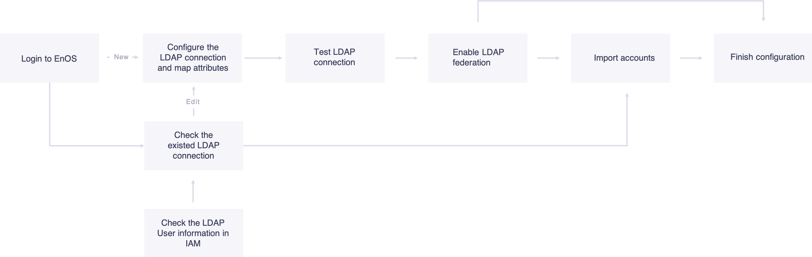

# Getting Started with LDAP Federation

This article instructs how to import LDAP users from an LDAP server and authorize the LDAP users through IAM.

Process of importing and authorizing an LDAP user.

## Target Audience
   OU Administrator

## Before You Begin

   1. Ensure that the LDAP server is working properly.
   2. You must know the username and password of the administrator account of the LDAP server. This administrator account should at least have full access to all base DNs.
   3. The access policies for LDAP users have been created in IAM. For detailed information, see [Managing policy](../managing_policies).

## Procedure

### Step 1: Establish Connection to LDAP Server

   To establish connection to the LDAP server:

   1. In the EnOS console, click **IAM > LDAP Federation** from the left navigation panel.
   2. In the **LDAP** page, Click **New LDAP Federation**. And provide the following settings:
      - **Realm**: The unique identity of the LDAP connection.
      - **Primary LDAP server**: The URL or IP address of the LDAP server.
      - **Port number**：Optionally, the port number of the LDAP server.
      - **Base DN**: The root distinguished name (DN) to use when importing users from the directory server. You can configure multiple base DNs under one LDAP server at once. Multiple base DNs are separated by semicolon (;). For example: cn=users,dc=example,dc=com;ou=users,dc=example,dc=com.
      - **Filter**: The filter to use when limit the entries within the base DNs. For example: FILTER=memberOf=CN=group,CN=developers,DC=example,DC=com.
          **Note**: Ensure that the entries have been selected are all valid account entries.
      - **User DN or name**: The username of the LDAP administrator account.
      - **Password**: The password of the LDAP administrator account.
      - **Attribute mapping**: The mapping relationship between system attributes and LDAP attributes.

   3. Click **Test** to test the connection to the LDAP server.
       - If test succeed, click **Done** to create the LDAP connection.
       - If test failed, you need to check the correctness of the information you entered and re-test the connection.

### Step 2: Enable LDAP Authentication

After the LDAP connection has been created, in the **LDAP Connection** page, toggle the **LDAP Authentication** switch button to enable the LDAP user login.

### (Optional) Step 3: Import LDAP Users to IAM

Import the LDAP users to IAM in advance can help you to authorize the LDAP users in batch.

To import LDAP users, do the following steps:
1. In the **LDAP Federation** page, click **view** after the LDAP server to edit.

2. Click **Import Account**, then LDAP users that have been selected are imported to IAM.
   **Note**: The LDAP users that already existed in the IAM will not be imported again.

### Step 4: Authorize LDAP Users

You can authorize the LDAP user individually or by adding the LDAP users to the authorized group.

- The authorized LDAP users can directly log in to EnOS Cloud with proper access rights.
- The unauthorized LDAP users cannot access to any services after logging in. Therefore, they need to contact the OU administrator to request permissions.

For more information, see [Creating and Managing Users](../managing_users).

## Results
The LDAP user can then log into the EnOS Console with the LDAP account credentials.
