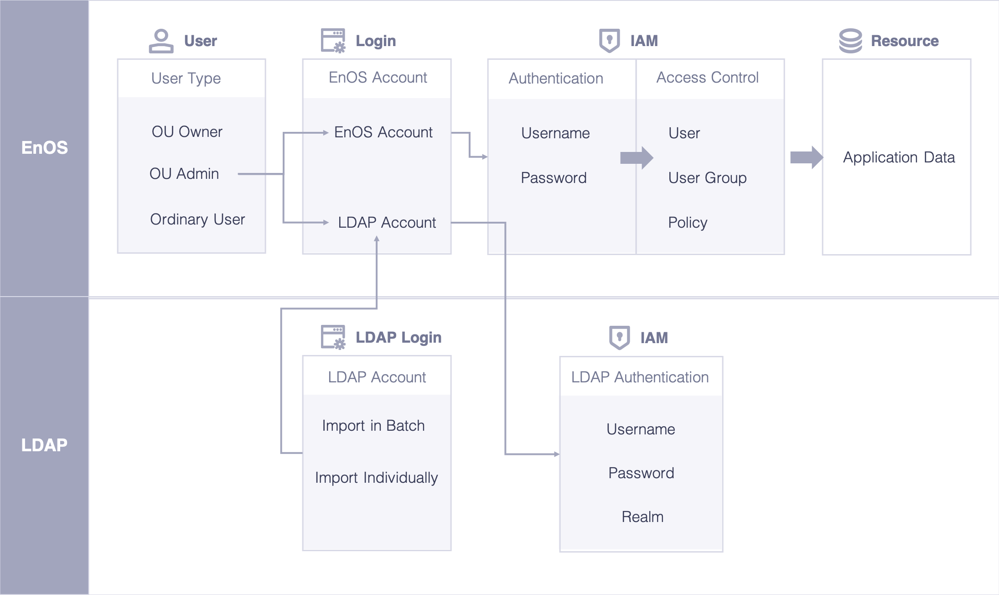

# LDAP federation overview

You can use Lightweight Directory Access Protocol (LDAP) instead of creating IAM user within EnOS cloud. EnOS Cloud supports to synchronize users from an LDAP directory to the EnOS and grant permission to these LDAP users.

## Key functionality

  - LDAP connections management

   + One organization can connect to one or more LDAP servers. Each LDAP connection can configure multiple base DN account.  And multiple organization can connection to the same LDAP server.

   + Make sure that the user information is consistent between EnOS IAM and LDAP server. If the user information has been changed on LDAP server, you can manually synchronize the changes to EnOS Cloud. And everytime user login, EnOS will detect the account information in LDAP serve.

   + LDAP users management. include add/edit/delete and view the detailed information of each LDAP connection.

  - LDAP user management

    + LDAP user authentication. The EnOS IAM supports grouping user and granting permissions of the LDAP users. The authorize the LDAP user can login to the EnOS with appropriate permissions.
    + The LDAP authentication can be enabled/disabled in EnOS console.

## Key concept

  - LDAP connection: The connection establishes between LDAP server and EnOS Cloud. Each LDAP connection contains the administrator account information of the LDAP server and configuration information of LDAP user import.
  - LDAP User:  Users that login to EnOS via LDAP.
  - System administrator: <!--等Alex的input-->
  - User：<!--等Alex的input-->

## Overview of the EnOS login

The following figure shows the overview of the EnOS login method

