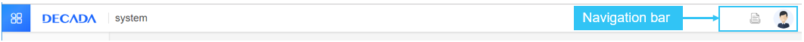

# Managing Navigation Panel

This article instructs how to manage navigation panel: create and manage the menu items of the navigation panel, synchronize the menu sequence or menu IDs to IAM for authorization purpose.

## Target Audience
   OU Owner

## Before You Begin

You should understand the hierarchy of the navigation panel:

 - Service category 1 (Service category)
   + First level menu item (Service)
     - Second level menu item (Sub-service)
     - Second level menu item
   + First level menu item
     ...
 - Service category 2
   + First level menu item
     ...

## Creating a First-level Menu Item

You can create a first-level menu item in the following approaches:

1. In the EnOS console, click **Management > Menu management**.
2. Select a category in the navigation column and click "+" to create a new menu item.
3. In the **Menu detail** page, provide proper settings, among these settings:
   - key(ID): The syntax of the key(ID) of the first-level menu item is _platform-{modulename}_. Maximum 64 characters in length.
   - Parent node: The parent node for a first-level navigation must be a category.
   - Add to common tab:
     + If select `Yes`, this menu item is displayed in both the **Common** tab and the **All** tab in navigation panel.
     + If select `No`, this menu item is only displayed in the **All** tab in navigation panel.
   -  Display in top navigation bar: If select `Yes`, the icon of this menu will be displayed in the top navigation bar as the below figure:
      
   - Visible to:
     + Authorized user: Indicates that the menu item is only visible to the users that have been granted permission in IAM.
     + Everyone: Indicates that the menu item is visible to all users.
     + OU admin and OU owner: Indicates that the menu item is only visible to OU admin and OU owner.  
   - Resource ID and Parent Resource ID are generated by EnOS.
4. Click **Save** to create the first-level menu item.

## Creating a Second-level Menu Item

You can create a second-level menu item in the following approaches:

1. In the EnOS console, click **Management > Menu management**.
2. Select a first-level menu item in the left-side column and click "+" to create a new menu item.
3. In the **Menu detail** page, provide proper settings, among these settings:
   - key(ID): The syntax of the key(ID) of the second-level menu item is _platform-{modulename}-{servicename}_. Maximum 64 characters in length.
   - Parent node: The parent node for a second-level menu item must be a first-level menu item.
   - URL: The URL of the menu. For example:`/portal/appmanagement.html`.
   - Resource ID and Parent Resource ID are generated by EnOS.
4. Click **Save** to create the second-level menu item.
